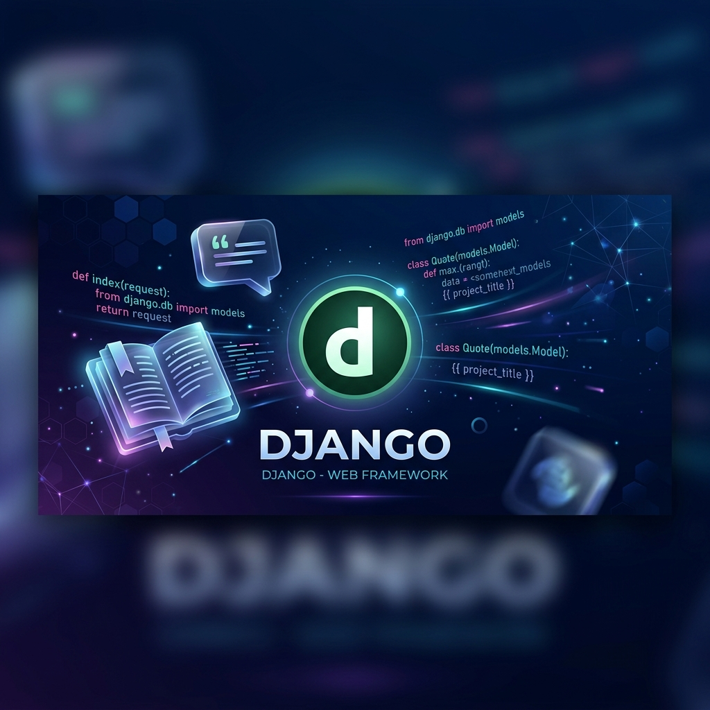

# 🚀 **Django Learning & Development Playground** 🛠️

Este repositorio ha sido diseñado como un espacio de experimentación y aprendizaje profundo sobre el framework **Django**. El objetivo principal es consolidar conocimientos técnicos a través de la implementación de diversos módulos funcionales, abarcando desde la gestión de bases de datos relacionales hasta la lógica de negocio compleja y el renderizado dinámico de plantillas.

---

## 🏗️ **Arquitectura del Proyecto**

El repositorio se organiza en múltiples aplicaciones independientes, cada una enfocada en practicar conceptos específicos de desarrollo web:

### 📚 **1. MiniLibrary (Gestión Literaria)**
Enfoque: **ORM y Relaciones de Base de Datos.**
*   Implementación de relaciones **One-to-One**, **ForeignKey** y **Many-to-Many**.
*   Gestión de autores, libros, géneros y reseñas de usuarios.
*   Uso de modelos extendidos para detalles técnicos y portadas multimedia.

### 💬 **2. Quotes App (Manejo de Rutas)**
Enfoque: **Vistas y Routing Dinámico.**
*   Configuración de URLs dinámicas con parámetros.
*   Lógica de manejo de errores personalizados (404).
*   Renderizado de listas dinámicas mediante diccionarios en Python.

### 🏠 **3. Landing (Portal de Entrada)**
Enfoque: **Integración y Estructura.**
*   Punto de acceso principal al ecosistema de aplicaciones.
*   Prácticas de diseño responsivo y navegación entre módulos.

---

## 🧠 **Conceptos Técnicos Aplicados**

*   **Django ORM:** Consultas avanzadas, filtrado y persistencia de datos en SQLite.
*   **Template Engine:** Uso de herencia de plantillas (`extends`, `block`), filtros y estructuras de control.
*   **Django Admin:** Personalización del panel administrativo para la gestión eficiente de registros.
*   **Middleware & Routing:** Manejo de redirecciones, nombres de rutas y namespaces.
*   **Migrations:** Control de versiones del esquema de base de datos.

---

## 🛠️ **Stack Tecnológico**

| Componente | Herramienta |
| :--- | :--- |
| **Framework** | Django 5.x |
| **Lenguaje** | Python 3.14+ |
| **Base de Datos** | SQLite (Entorno de desarrollo) |
| **Frontend** | HTML5, CSS3, JavaScript |

---

## ⚙️ **Configuración del Entorno**

Para replicar este entorno de desarrollo localmente, se deben seguir los siguientes pasos técnicos:

### **1. Clonación y Entorno Virtual**
```powershell
git clone https://github.com/AlxLR0/playground_django.git
cd playground_django
python -m venv venv
.\venv\Scripts\activate
```

### **2. Instalación de Dependencias**
```bash
pip install -r requirements.txt
```

### **3. Migraciones y Ejecución**
```bash
python manage.py makemigrations
python manage.py migrate
python manage.py runserver
```

---

## 📝 **Notas de Desarrollo**

Este repositorio se mantiene en constante evolución, funcionando como un diario técnico de progreso en el ecosistema de Python y Django. Se prioriza la legibilidad del código y la implementación de mejores prácticas sugeridas por la documentación oficial de Django.

---

**Desarrollado por [AlxLR](https://github.com/AlxLR0)**
